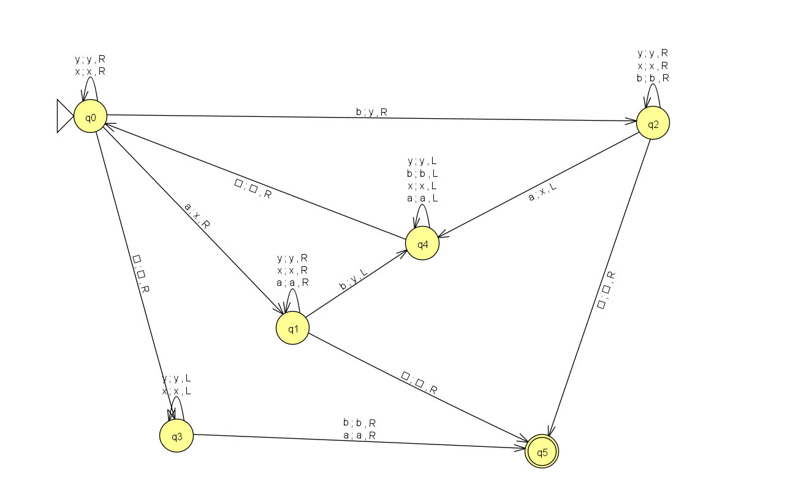
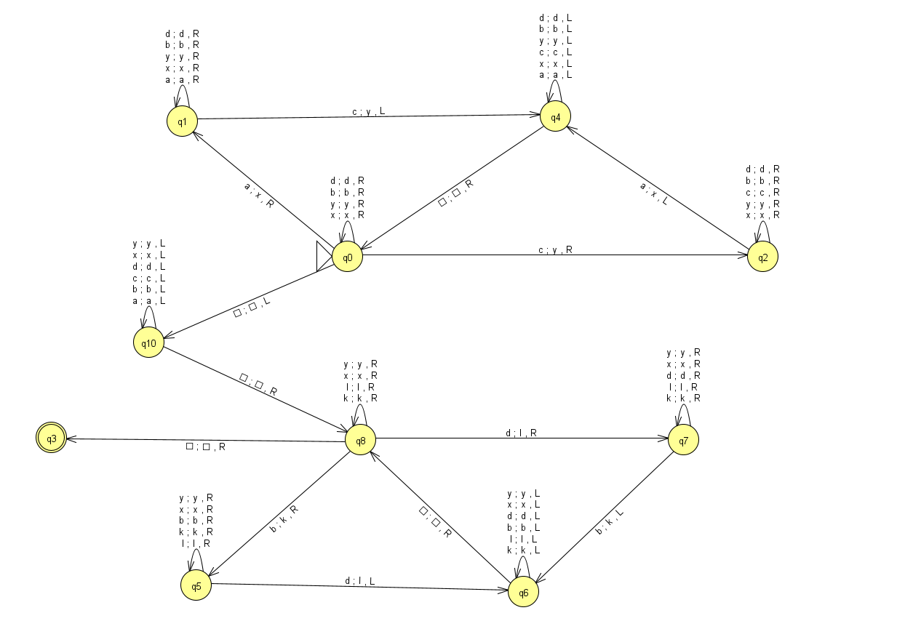

# Exercícios para treino de Análise de Computabilidade e Complexidade de Algorítmos
Exercícios  de uma prova da matéria Analise de Computabilidade e Complexidade de Algorítmos, algumas questões para refletir sobre a computabilidade e complexidade de alguns algoritmos, utilizando automação de testes com JUnit...

---

## Descrição do Projeto

Este projeto reúne exercícios práticos de Análise de Computabilidade e Complexidade de Algoritmos, abordando questões clássicas sobre linguagens formais, algoritmos e máquinas de Turing. O objetivo é implementar, testar e analisar algoritmos em Java, utilizando automação de testes com JUnit para garantir a corretude e decidibilidade das soluções.

### Questão 01: Verificação de Palíndromos

- Implementação de um algoritmo em Java para verificar se uma palavra sobre o alfabeto `{a, b}` é palíndroma, **sem utilizar comandos prontos de reversão**.
- Implementação de uma Máquina de Turing em Java para o mesmo propósito.
- Análise de computabilidade e decidibilidade dos dois algoritmos, verificando sua equivalência.
- Testes automatizados com JUnit, incluindo 10 entradas (palíndromas e não-palíndromas), garantindo 100% de acerto.

### Questão 02: Torre de Hanói

- Implementação das versões **iterativa** e **recursiva** do algoritmo da Torre de Hanói.
- Demonstração da equivalência entre as duas abordagens.
- Análise da complexidade dos algoritmos.

### Questão 03: Linguagens Decidíveis

- Implementação e teste de Máquinas de Turing para duas linguagens:
  - **Linguagem 1:** `{a^m b^n | m ≠ n}`
  - **Linguagem 2:** `{a^n b^k c^n d^k | n, k ≥ 0}`
- Verificação da decidibilidade das linguagens por meio de testes automatizados.

#### Exemplos ilustrativos das linguagens

**Linguagem 1:** `{a^m b^n | m ≠ n}`  
Exemplos válidos:  
- `aabbb` (m=2, n=3)  
- `aaa` (m=3, n=0)  
- `bb` (m=0, n=2)  
Exemplo inválido:  
- `aa bb` (m=2, n=2)

**Linguagem 2:** `{a^n b^k c^n d^k | n, k ≥ 0}`  
Exemplos válidos:  
- `ab cd` (n=1, k=1)  
- `aabbccdd` (n=2, k=2)  
- `ccdd` (n=0, k=2)  
- `aacc` (n=2, k=0)  
Exemplo inválido:  
- `aabccdd` (n=2, k=1, n≠c ou k≠d)

---

O projeto utiliza **JUnit** para automação dos testes, garantindo a confiabilidade dos algoritmos implementados. Cada exercício é acompanhado de análise teórica e prática sobre computabilidade, decidibilidade e complexidade.